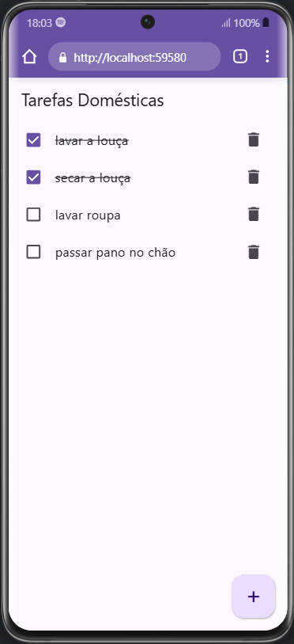
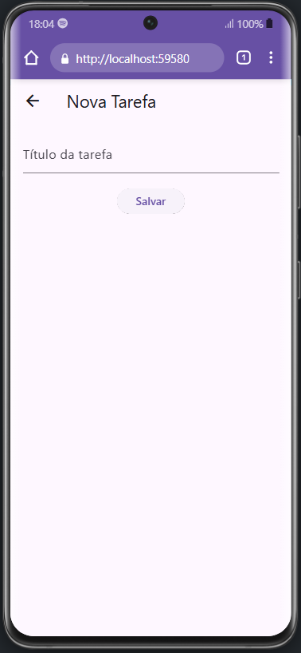

# 🧹 App de Controle de Tarefas Domésticas

Um aplicativo simples feito em Flutter para ajudar no gerenciamento de tarefas domésticas. Ele permite que o usuário:

- Adicione, edite e exclua tarefas;
- Marque tarefas como concluídas;
- Armazene os dados localmente usando SharedPreferences;
- Navegue entre duas telas com um layout organizado e responsivo.

---

## 📸 Capturas de Tela

### 📋 Lista de Tarefas



### ➕ Adicionar Nova Tarefa



> Obs: salve as imagens das telas na pasta `screenshots/` e use os nomes correspondentes.

---

## 🛠️ Instruções de Instalação

Siga os passos abaixo para rodar o app localmente em seu ambiente Flutter:

### 1. Clone o repositório

```bash
git clone https://github.com/PedroLeuchs/tarefa_domesticas_flutter.git
cd tarefas-domesticas-flutter
```

### 2. Instale as depêndencias

```bash
flutter pub get
```

### 2. Inicia o projeto

```bash
flutter run
```
